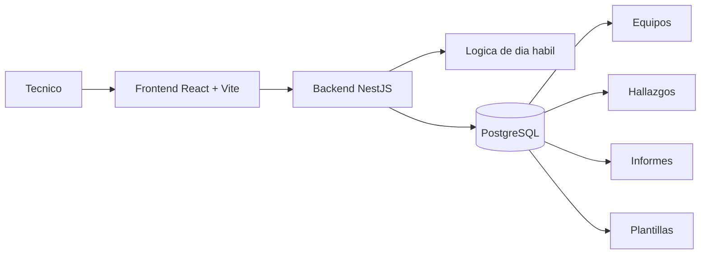

# Sistema de Gestion de Hallazgos e Informes de Mantenimiento


Aplicacion web orientada a tecnicos de mantenimiento para centralizar tres tareas operativas: consultar los equipos programados del dia habil, gestionar hallazgos historicos y generar informes tecnicos editables a partir de plantillas por modulo.

## Resumen

El sistema reduce el trabajo manual de consulta y redaccion concentrando en una sola plataforma:

1. Equipos programados segun dia habil.
2. Hallazgos abiertos, pendientes y solucionados.
3. Informes de mantenimiento generados y persistidos.

## Que resuelve

Antes del sistema, el tecnico dependia de varias fuentes dispersas: mensajes, apuntes, historial de reparaciones y consultas a terceros. Este proyecto busca reducir esa friccion operativa con un flujo continuo desde la consulta del equipo hasta el guardado del informe final.

## Capacidades principales

- Consulta automatica de equipos programados para el dia habil actual.
- Busqueda de equipos por ID, nombre o ruta.
- Consulta de hallazgos recientes con ventana operativa de cinco meses.
- Creacion de nuevos hallazgos y actualizacion de estado.
- Historial de cambios de estado por hallazgo.
- Generacion automatica de informes con plantillas por modulo.
- Edicion del informe antes de guardarlo.
- Limite de 1 a 3 modulos por informe.

## Arquitectura



## Stack real del proyecto

- Backend: NestJS, TypeORM, PostgreSQL.
- Frontend: React, TypeScript, Vite, Tailwind.
- Scripts locales: PowerShell.

Nota: el planteamiento funcional original menciona Angular, pero la implementacion actual del frontend esta construida con React.

## Estructura del repositorio

```text
.
|-- backend/
|   |-- src/
|   |-- scripts/
|   |-- sql/
|   `-- test/
|-- frontend/
|   `-- src/
|-- scripts/
|-- docs/
|-- spec generales/
|-- PLANTEAMIENTO.md
|-- analisis_planteamiento.md
`-- README.md
```

## Modulos funcionales

### Backend

- `auth`: login tecnico y resolucion de ruta operativa.
- `equipos`: filtros, dia habil, slots de mantenimiento y consulta operativa.
- `hallazgos`: consulta, creacion, actualizacion e historial de estados.
- `informes`: preview, composicion y persistencia de informes.
- `plantillas`: observaciones estandar por modulo.
- `modulos`: catalogo de modulos permitidos.
- `mantenimientos`: soporte de entidad y relaciones base.

### Frontend

- Dashboard de inicio con calendario y KPIs.
- Busqueda de equipos.
- Gestion de hallazgos.
- Generador de informes con editor y autosave local.
- Historial de mantenimientos.

## Requisitos

- Node.js 20 o superior recomendado.
- npm.
- PostgreSQL disponible para el backend.
- PowerShell 5.1 o superior en Windows.

## Configuracion local

Crear o completar `backend/.env` con la configuracion de base de datos y valores operativos.

Variables usadas por el backend:

- `DB_HOST`
- `DB_PORT`
- `DB_USER`
- `DB_PASSWORD`
- `DB_NAME`
- `PORT` opcional, por defecto `3000`
- `HOLIDAYS` opcional, CSV de fechas ISO
- `AUTH_DEFAULT_USUARIO` opcional
- `AUTH_DEFAULT_PASSWORD` opcional
- `AUTH_DEFAULT_CEDULA` opcional
- `AUTH_DEFAULT_NOMBRE` opcional
- `AUTH_DEFAULT_RUTA` opcional

## Instalacion

```powershell
npm install --prefix backend
npm install --prefix frontend
```

## Arranque rapido

### Opcion recomendada

```powershell
npm run dev:up
```

Este script:

- libera los puertos `3000`, `5173` y `5174`,
- levanta backend y frontend,
- espera disponibilidad HTTP,
- ejecuta un smoke test basico,
- guarda estado de procesos en `.runtime/`.

Para apagar ambos servicios:

```powershell
npm run dev:down
```

### Ejecucion manual

Backend:

```powershell
npm --prefix backend run start:dev
```

Frontend:

```powershell
npm --prefix frontend run dev -- --host 0.0.0.0 --port 5173
```

## URLs locales

- Frontend: `http://localhost:5173`
- Backend: `http://localhost:3000`
- Health check: `http://localhost:3000/health`

## Scripts disponibles

### Raiz

- `npm run dev:up`
- `npm run dev:down`

### Backend

- `npm --prefix backend run build`
- `npm --prefix backend run start`
- `npm --prefix backend run start:dev`
- `npm --prefix backend run test`
- `npm --prefix backend run auth:list-users`

### Frontend

- `npm --prefix frontend run dev`
- `npm --prefix frontend run build`
- `npm --prefix frontend run lint`
- `npm --prefix frontend run preview`

## Endpoints principales

### Autenticacion

- `POST /auth/login`

### Equipos

- `GET /equipos`
- `GET /calendario/mes?fecha=YYYY-MM-DD`

### Hallazgos

- `GET /hallazgos`
- `GET /hallazgos/:id/historial-estados`
- `POST /hallazgos`
- `PATCH /hallazgos/:id`
- `PUT /hallazgos/:id`

### Informes

- `GET /informes`
- `POST /informes/preview`
- `POST /informes`
- `PATCH /informes/:id/finalizar`

### Catalogos

- `GET /plantillas`

## Reglas de negocio relevantes

- Los equipos operativos del dia se calculan segun dia habil.
- Los hallazgos se consultan por defecto sobre una ventana de cinco meses.
- Un hallazgo puede estar en `ABIERTO`, `PENDIENTE` o `SOLUCIONADO`.
- Si un hallazgo se soluciona, se registra `fechaSolucion`.
- Un informe solo admite entre 1 y 3 modulos.
- Si no existe plantilla para un modulo, el contenido se puede redactar manualmente.

## Documentacion del repositorio

- `PLANTEAMIENTO.md`: planteamiento funcional base.
- `analisis_planteamiento.md`: auditoria de cumplimiento frente al planteamiento.
- `docs/ARQUITECTURA_DETALLADA_MERMAID.md`: arquitectura funcional detallada.
- `spec generales/`: especificaciones funcionales y de datos.
- `backend/docs/mvp-endpoints.http`: pruebas manuales de endpoints.

## Estado actual

El proyecto ya implementa el flujo principal del MVP:

- consulta operativa de equipos,
- gestion de hallazgos,
- generacion y guardado de informes,
- scripts de arranque local,
- smoke test basico.

Brechas tecnicas identificadas en la auditoria:

- falta endurecer autenticacion y autorizacion de endpoints de escritura,
- parte del esquema se ajusta en runtime y conviene migrarlo a migraciones versionadas,
- faltan pruebas formales de rendimiento con umbrales contractuales.

## Roadmap recomendado

1. Proteger endpoints criticos con autenticacion fuerte y guards.
2. Formalizar migraciones de base de datos.
3. Agregar pruebas de performance y autorizacion.
4. Mantener alineado el planteamiento documental con la implementacion real.
